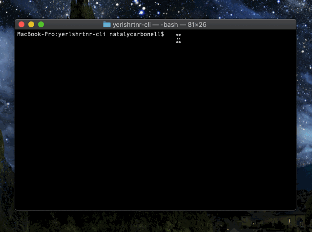

# Yerlshrtnr

A simple interactive command line URL shortener built with Node.js and Redis.

As of right now, this app:

* Returns a default shortened URL (random character)
* Returns a custom shortened URL upon request(optional)
* Provides expiration of a URL upon request (optional)


### Demo


### Installing

Running yerlshrtnr is simple. Make sure you have node.js installed in your machine.

Install modules

```
npm install
```

Run script globally

```
npm link
```

Run yerlshrtnr from anywhere in your machine

```
yerlshrtnr
```